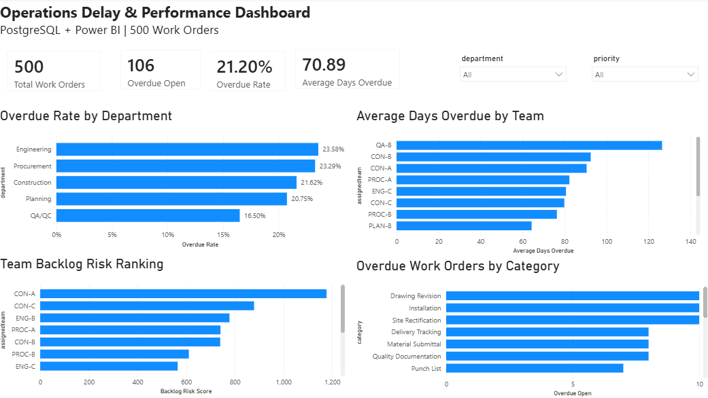

# Operations Delay & Performance Analysis

## Overview

This portfolio project analyzes 500 operational work orders using PostgreSQL and Power BI to identify backlog, overdue workload, aging risk, team performance, and operational bottlenecks.

The objective is to demonstrate how raw operational data can be transformed into management-ready insights using SQL analysis, reusable database logic, and interactive business intelligence reporting.

## Business Problem

Operations teams often track hundreds of work orders across multiple departments and teams.

Management needs to understand:

- Which departments have the highest overdue workload?
- Which teams have the highest operational risk?
- Which categories contribute most to backlog?
- How old are the overdue items?
- Which areas should be prioritized for intervention?

Raw counts alone can be misleading, so the analysis considers overdue rate, backlog volume, aging, and severity.

## Tools Used

- **PostgreSQL** — data storage and SQL analysis
- **pgAdmin 4** — database management and query development
- **Power BI** — dashboard development and visualization
- **GitHub** — project documentation and portfolio presentation

## Dataset

The project uses a simulated dataset of **500 operational work orders** across:

- Engineering
- QA/QC
- Construction
- Procurement
- Planning

Key fields include:

- Work Order ID
- Department
- Category
- Priority
- Assigned Team
- Created Date
- Due Date
- Completed Date
- Status
- Estimated Hours
- Actual Hours
- Cost

The dataset is available in:

`data/Portfolio_02_Work_Orders_500.csv`

## SQL Analysis

The SQL workflow is organized into five scripts:

### 1. Data Exploration

`sql/01_data_exploration.sql`

Used to inspect the dataset, validate row counts, and summarize workload by status and department.

### 2. Overdue Analysis

`sql/02_overdue_analysis.sql`

Analyzes:

- Overdue open work orders
- Overdue rate by department
- Aging of overdue items
- Maximum and average days overdue

### 3. Team Performance Analysis

`sql/03_team_analysis.sql`

Compares:

- Team overdue rates
- Average overdue age
- Overdue backlog volume
- Custom Backlog Risk Score

The custom prioritization metric is:

**Backlog Risk Score = Overdue Items × Average Days Overdue**

This score is used as a project-specific decision-support metric rather than a standard industry KPI.

### 4. Root-Cause Analysis

`sql/04_root_cause_analysis.sql`

Performs drill-down analysis by:

- Category
- Priority
- Category + priority combination
- Work-order aging

This analysis was used to investigate the QA-A backlog in more detail.

### 5. Power BI Analytical View

`sql/05_analysis_view.sql`

Creates a reusable PostgreSQL view containing calculated fields such as:

- Work Order State
- Overdue Status
- Days Overdue
- Completion Performance
- Completion Delay Days
- Hours Variance

The SQL view is used as the analytical source for Power BI.

## Power BI Dashboard



The dashboard includes:

- Total Work Orders
- Overdue Open Work Orders
- Overall Overdue Rate
- Average Days Overdue
- Overdue Rate by Department
- Average Days Overdue by Team
- Team Backlog Risk Ranking
- Overdue Work Orders by Category
- Department and Priority slicers

## Key Results

### Core KPIs

- **500** total work orders
- **106** overdue open work orders
- **21.20%** overall overdue rate
- **70.89 days** average overdue age

### Department Performance

Engineering had the highest department overdue rate at **23.58%**.

Construction had more overdue work orders in absolute terms, demonstrating why normalized performance measures are necessary when comparing departments of different sizes.

### Team Risk

CON-A had the highest combined backlog risk:

- 13 overdue items
- 90.54 average days overdue
- Backlog Risk Score: **1,177**

QA-B had the highest average overdue age at **126.50 days**, but only two overdue items.

This demonstrates the difference between backlog-volume risk and aging risk.

### Root-Cause Findings

Within QA-A:

**Quality Documentation**
- 9 total work orders
- 4 overdue
- 44.44% overdue rate

Quality Documentation represented the largest backlog-volume issue.

**Inspection**
- 3 overdue items
- 77 average days overdue
- Maximum age of 117 days

Inspection represented a stronger aging-severity issue.

## Management Recommendations

1. Prioritize CON-A for immediate backlog reduction because it combines high overdue volume with long aging.
2. Review QA-B's old unresolved items despite its small backlog volume.
3. Investigate the QA-A Quality Documentation workflow for bottlenecks.
4. Escalate long-aging Inspection work orders.
5. Evaluate operations using multiple KPIs instead of overdue counts alone.

## Project Structure

```text
operations-delay-performance-analysis/
├── README.md
├── data/
│   └── Portfolio_02_Work_Orders_500.csv
├── sql/
│   ├── 01_data_exploration.sql
│   ├── 02_overdue_analysis.sql
│   ├── 03_team_analysis.sql
│   ├── 04_root_cause_analysis.sql
│   └── 05_analysis_view.sql
├── dashboard/
│   └── operations-delay-dashboard.png
└── insights/
    └── key-findings.md
```

## Skills Demonstrated

- PostgreSQL
- SQL querying
- Data exploration
- Aggregation and filtering
- CASE expressions
- PostgreSQL FILTER
- KPI development
- Backlog analysis
- Aging analysis
- Root-cause investigation
- Power BI
- DAX measures
- Dashboard design
- Operational analytics
- Business recommendations

## Business Value

This project demonstrates an end-to-end analytics workflow:

**Raw Data → PostgreSQL → SQL Analysis → Analytical View → Power BI → Management Insights**

The focus is not only on producing charts, but on identifying operational risk, explaining why it matters, and recommending where management attention should be directed.
